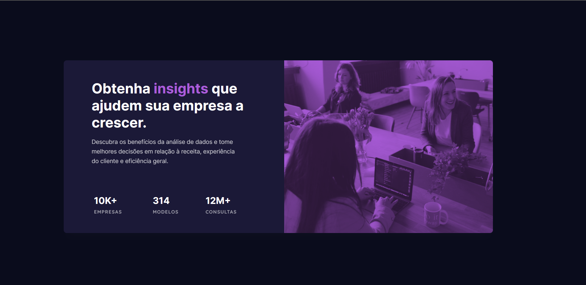

# 🧠 Desafio Frontend Mentor | Serviços

---

## 🛠️ Tecnologias

  

---

## 👨‍🎓 O que aprendi

- Aplicar o Box Model
- Fortalecer conceitos
- TAG's semânticas
- Posicionamento de elementos

---

## 📧 Contato

<a href = "mailto:probertos717@gmail.com">